<h2 class="r-fit-text" style="text-align: center"> La ciberseguridad en el ámbito el educativo </h2>

 
---

## Desmitificando la Ciberseguridad

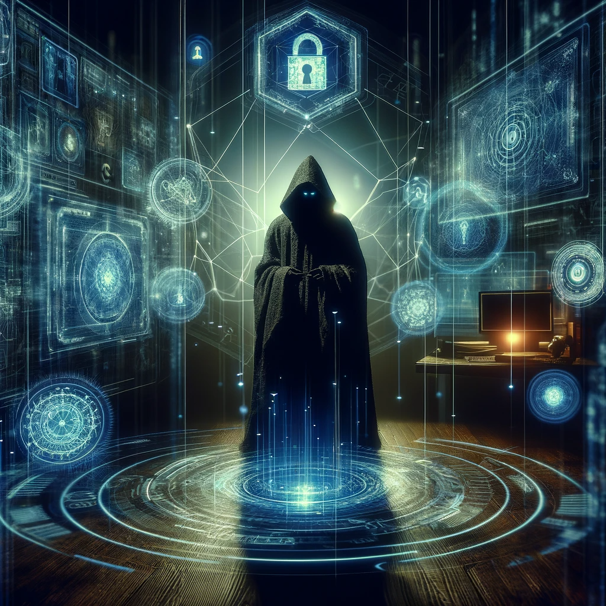

### Mitos

* Los hackers son personas malintencionadas.<!-- .element: class="fragment" -->

* Con un antivirus, mi dispositivo está seguro.<!-- .element: class="fragment" -->

* Los Macs no pueden ser infectados por virus.<!-- .element: class="fragment" -->

* El phishing es para atacar grandes empresas u organizaciones.<!-- .element: class="fragment" -->
<!-- .element: class="fragment" -->
* Si una página web tiene el candadito cerrado y/o verde, es 100% seguro.<!-- .element: class="fragment" -->

Note:
* Los hackers son personas malintencionadas.
Realidad: Existen hackers éticos, dedicados a fortalecer la seguridad, a través de pruebas de penetración y análisis de vulnerabilidades.

* Con un antivirus, mi dispositivo está 100% seguro.
Realidad: Si bien el antivirus es una herramienta útil, no es una solución completa. La ciberseguridad es un enfoque en capas que requiere medidas adicionales, como mantener el software actualizado y practicar buenas contraseñas.

* Los Macs no pueden ser infectados por virus.
Realidad: Aunque macOS tiene una seguridad sólida, no es inmune a los virus y malware. Los ciberdelincuentes también atacan a usuarios de Mac, y se deben tomar precauciones para proteger estos dispositivos.

* El phishing es para atacar grandes empresas u organizaciones.
Realidad: Los ciberataques no tiene un único objetivo; las pequeñas empresas y la ciudadanía suelen ser más vulnerables.

* Si una página web tiene el candadito cerrado y/o verde, es 100% seguro.  
Realidad: Indica que la conexión está cifrada, aunque no garantiza la legitimidad del sitio. Es importante verificar la URL y la fuente.

* Por seguridad, nunca accedo a mis cuentas en las Wi-Fi públicas, solo lo hago en casa o en la oficina.

* No tengo que preocuparme por mis datos, los tengo a salvo en la nube.<!-- .element: class="fragment" -->

* Solo recibo correos electrónicos seguros de amigos y familiares.<!-- .element: class="fragment" -->

* No tengo dinero, soy solo un usuario común, los ciberdelincuentes no se fijarán en mí.<!-- .element: class="fragment" -->

Note:

* Nunca accedo a mis cuentas en las Wi-Fi públicas, solo lo hago en casa o en la oficina. 
Realidad: El 80% de los ataques son internos, la seguridad es mas laxa.

* No tengo que preocuparme por mis datos, los tengo a salvo en la nube.
Realidad: La seguridad en la nube es sólida, pero la responsabilidad de proteger tus datos también recae en ti. Utiliza autenticación de doble factor y contraseñas fuertes para proteger tus cuentas en la nube.

* Solo recibo correos electrónicos seguros de amigos y familiares.
Realidad: Los ciberdelincuentes pueden suplantar identidades y enviar correos electrónicos falsos. Siempre verifica la autenticidad antes de hacer clic en enlaces o descargar archivos adjuntos.

* No tengo dinero, soy solo un usuario común, los ciberdelincuentes no se fijarán en mí.
Realidad: Aunque puedas pensar que tu perfil no es relevante y aunque no tengas grandes sumas de dinero para los ciberdelincuentes, la realidad es que todos somos susceptibles a ser víctimas de ataques cibernéticos.

### Algunas realidades...

* En promedio, ocurre un ciberataque cada 39 segundos.<!-- .element: class="fragment" -->

* Los ciberataques aumentaron en un 38% en 2022.<!-- .element: class="fragment" -->

* El 43% de los ciberataques están dirigidos a particulares y pequeñas empresas.<!-- .element: class="fragment" -->

* El costo global de la ciberdelincuencia se estima en $6 trillones anuales, superando el valor del narcotráfico.<!-- .element: class="fragment" -->

Note:

Estos puntos destacan la frecuencia, el crecimiento, la diversidad de víctimas y el impacto económico significativo de los ciberataques, proporcionando una perspectiva impactante y relevante para introducir tu curso.

- [Balance de Ciberseguridad 2022 (INCIBE)](https://portal.mineco.gob.es/RecursosNoticia/mineco/prensa/noticias/2023/Balance_de_Ciberseguridad_2022_INCIBE.pdf)

### Hay dos tipos de personas
 
* La que ha sido hackeada...<!-- .element: class="fragment" -->

* Y la que no sabe que ha sido hackeada.<!-- .element: class="fragment" -->

### Nuetro objetivo: Guía de Supervivencia

Note:
Representación creativa y simbólica de una "Guía de Supervivencia en Ciberseguridad" para profesorado.

La imagen muestra un paisaje digital con un camino que atraviesa diversas amenazas cibernéticas, como enormes candados, correos electrónicos en forma de trampas y almacenamiento de datos en forma de nubes flotantes. Un grupo de personajes animados, representando a profesores, navega con confianza por el camino, armados con escudos y linternas que simbolizan el conocimiento y la conciencia. 

###

* Crear juntos una guía práctica y realista.

* Aprenderemos a protegernos en el mundo digital.<!-- .element: class="fragment" -->

* No hay que temer, ¡estamos preparados!<!-- .element: class="fragment" -->

---
<!-- ## Introducción a la Ciberseguridad

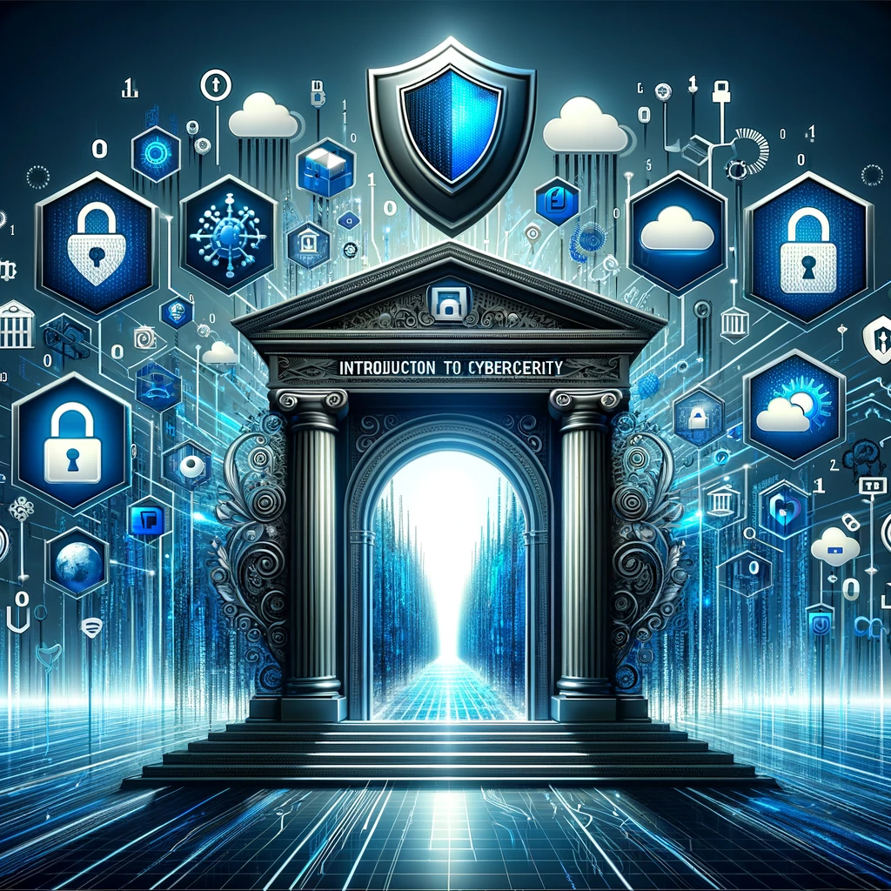 -->

## Internet fue diseñada por caballeros y para caballeros

### Ataques comunes en las capas del modelo OSI

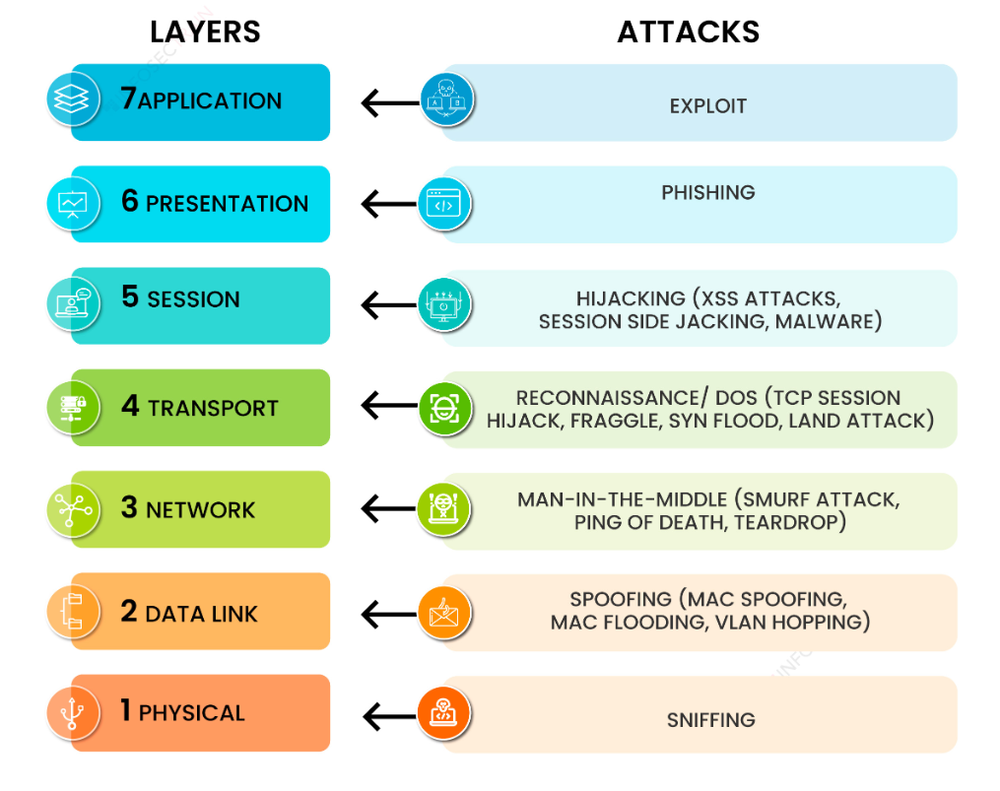

### El Desafío de Capa 8

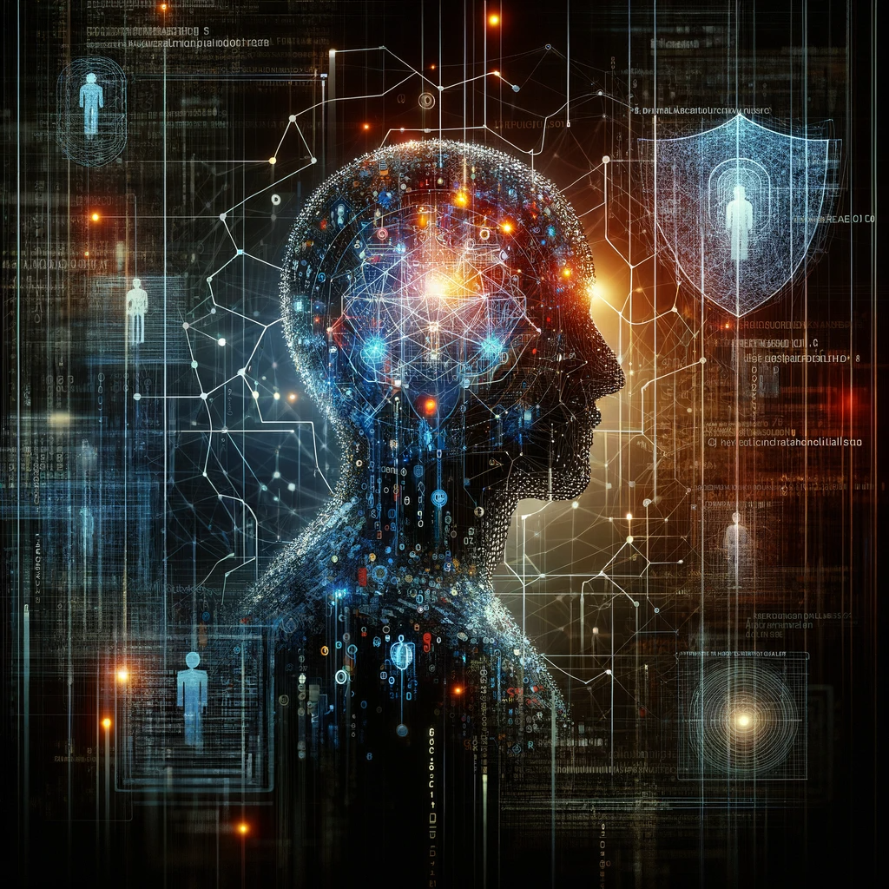

Note:
Esta imagen muestra una silueta humana llena de código digital y conexiones de red, simbolizando la vulnerabilidad y complejidad de los factores humanos en la seguridad digital. El fondo incluye capas de escudos y barreras digitales, representando esfuerzos para mejorar las defensas contra las vulnerabilidades humanas. 
* **La imagen intenta transmitir que el elemento humano es tanto el más débil como el más crucial en la ciberseguridad.**

###

* Capa 8: El Escollo Humano.

* Psicología: Punto de Ataque.<!-- .element: class="fragment" -->

* Sin Solución Única.<!-- .element: class="fragment" -->

* Fortaleciendo Defensas.<!-- .element: class="fragment" -->

Note:
* Capa 8: El Escollo Humano - Destaca la singularidad del factor humano en ciberseguridad.
* Psicología: Punto de Ataque - Subraya cómo las diferencias individuales hacen vulnerables a las personas.
* Sin Solución Única - Reconoce la ausencia de una solución estándar para los problemas de la Capa 8.
* Fortaleciendo Defensas - Enfatiza la importancia de reforzar la seguridad alrededor del elemento humano.

### Peligos más comunes

*  Robo de credenciales<!-- .element: class="fragment" -->

*  Engaños y suplantaciones de identidad (phishing)<!-- .element: class="fragment" -->

*  Pérdida o filtrado de información<!-- .element: class="fragment" -->

Note:
- [10 Most Common Types of Cyber Attacks](https://www.crowdstrike.com/cybersecurity-101/cyberattacks/most-common-types-of-cyberattacks/)

### Mis datos, mi tesoro

### Sus datos, tu responsabilidad

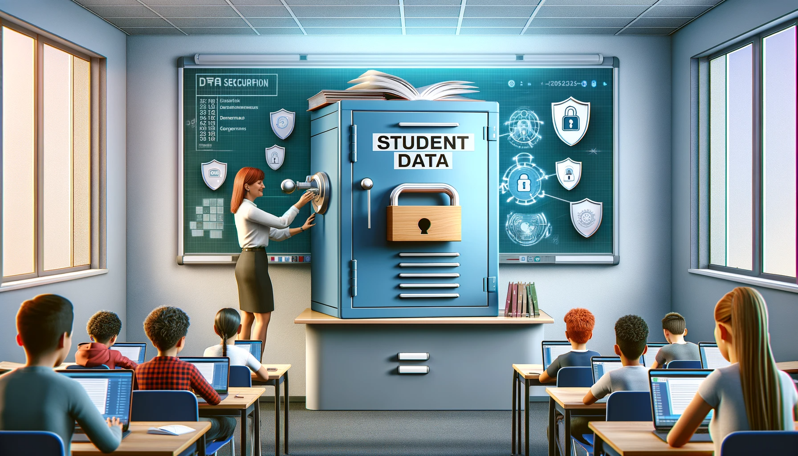

###
*  ¿Dónde están los datos de mi alumnado?

*  ¿Puedo usar cualquier aplicación libremente?<!-- .element: class="fragment" -->

*  ¿Quién tiene la responsabilidad?<!-- .element: class="fragment" -->

### Nuevos Desafíos en la Ciberseguridad

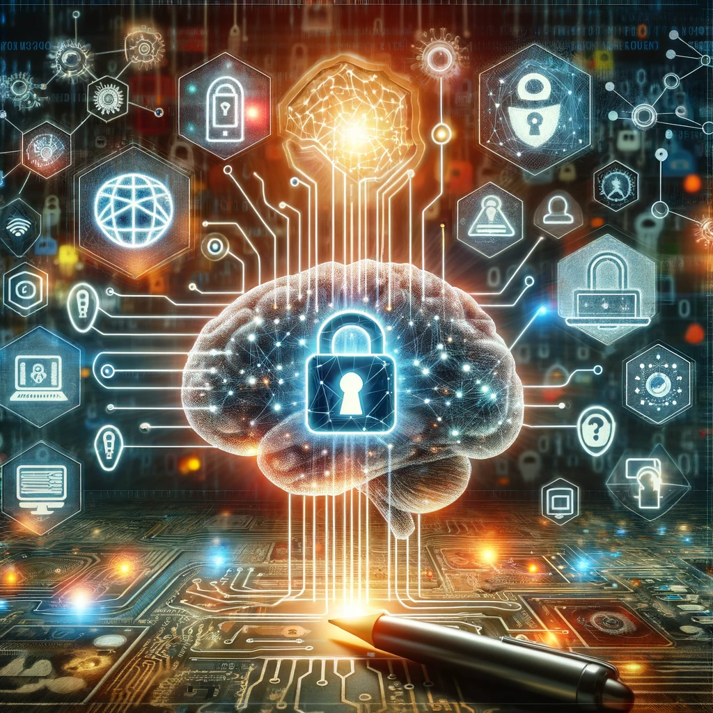

###

* Auge de IA en ataques.

* Vulnerabilidades IoT.<!-- .element: class="fragment" -->

### Estrategia de Defensa en Profundidad

###

* Múltiples Capas de Seguridad.

* Prevención y Detección Combinadas.<!-- .element: class="fragment" -->

* Reducción de Riesgos.<!-- .element: class="fragment" -->

* Adaptabilidad y Resiliencia.<!-- .element: class="fragment" -->

Note:
* Múltiples Capas de Seguridad: Cada capa ofrece protección adicional.
* Prevención y Detección Combinadas: Sistemas complementarios para mayor eficacia.
* Reducción de Riesgos: Cada barrera reduce la probabilidad de brechas.
* Adaptabilidad y Resiliencia: Capacidad para resistir y adaptarse a amenazas cambiantes.

---

## Resguardando tu privacidad

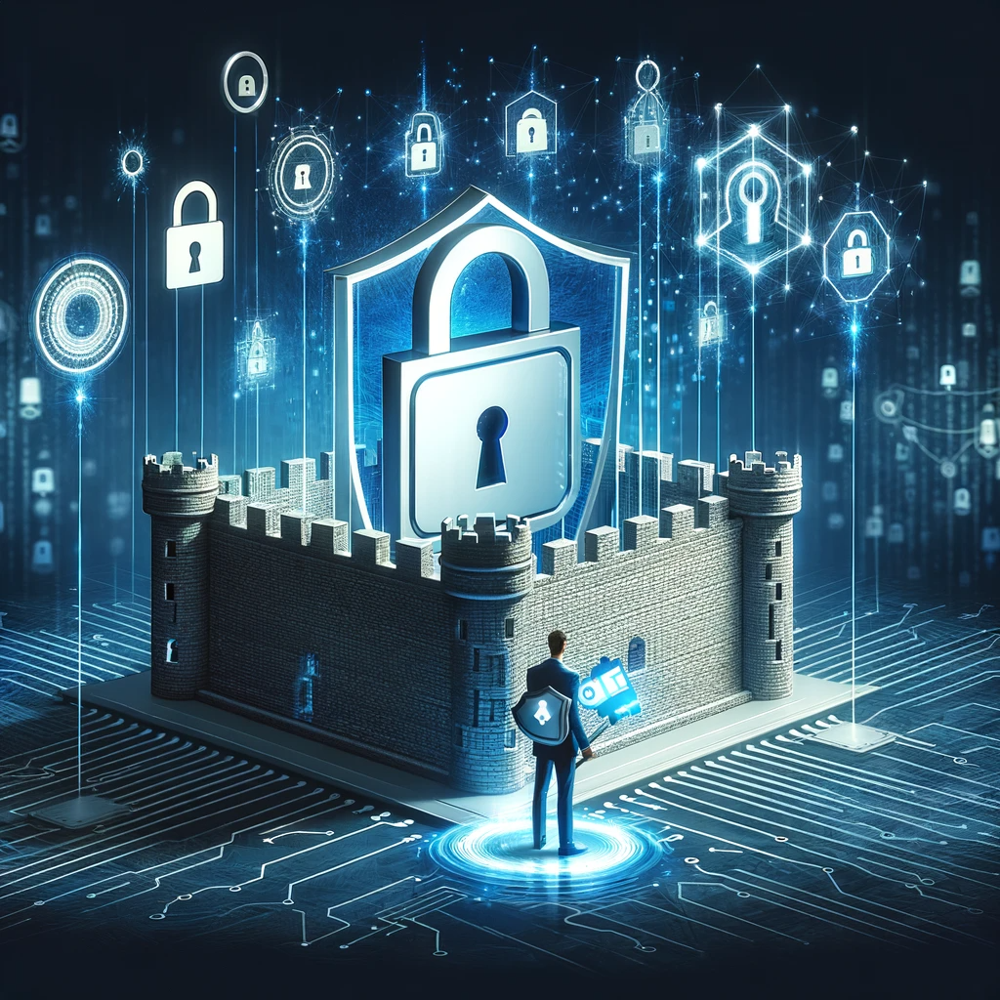

### Cuando los USB se Vuelven Contra Nosotros

### 

* Daño físico: "USBs pueden quemar equipos".

* Malware oculto: "Riesgo de virus y spyware".<!-- .element: class="fragment" -->

* Robo de datos: "Extracción silenciosa de info".<!-- .element: class="fragment" -->

* Acceso no autorizado: "Permiten hackeos remotos".<!-- .element: class="fragment" -->

* Infiltración de red: "Puerta trasera a sistemas".<!-- .element: class="fragment" -->

### El Pato en Acción: Demostrando la Seguridad USB"

### 

* Desconfiar y no conectar a nuestros equipos dispositivos encontrados en espacios públicos o de origen desconocido.

* Deshabilitar la función de autoarranque de dispositivos USB. <!-- .element: class="fragment" -->

* Disponer de un antivirus activo y debidamente actualizado.<!-- .element: class="fragment" -->

### Deshabilitar la función de autoarranque de dispositivos USB

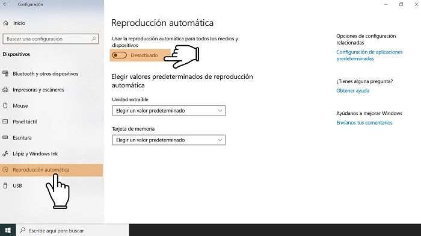

Note:
De este modo, si por error conectamos un dispositivo USB infectado a nuestro equipo, el malware o las herramientas que contenga no se activarán automáticamente, y podremos analizar y eliminar esas amenazas con un antivirus. En Windows, por ejemplo, para hacerlo deberemos acceder al icono de Windows > Configuración > Dispositivos > Reproducción automática y desactivar esta opción.

###

* Una vez conectado, haremos clic derecho sobre él.

* Luego, haremos clic sobre “Analizar con…”

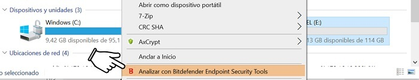

### El Poder del Cifrado: Protegiendo Nuestros Datos

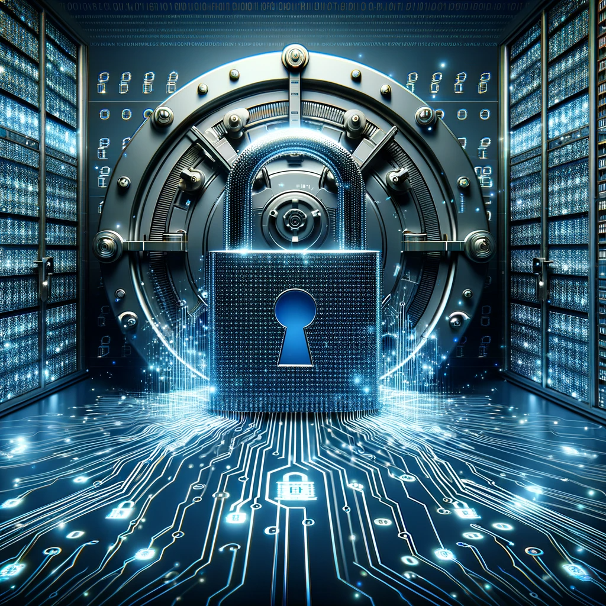

###
* Cifrado de archivos y carpetas.

* Cifrado de un disco duro.<!-- .element: class="fragment" -->

* Cifrado de un dispositivos USB.<!-- .element: class="fragment" -->

* Cifrado de un dispositivo Android.<!-- .element: class="fragment" -->

Note: 
Cifrar los discos, soportes y dispositivos, de tal modo que en caso de pérdida o robo, la información quede protegida y no podrá ser consultada por los ciberdelincuentes. De este modo, solo se convierte en una pérdida económica, evitando una brecha de seguridad de la información.

### Demo
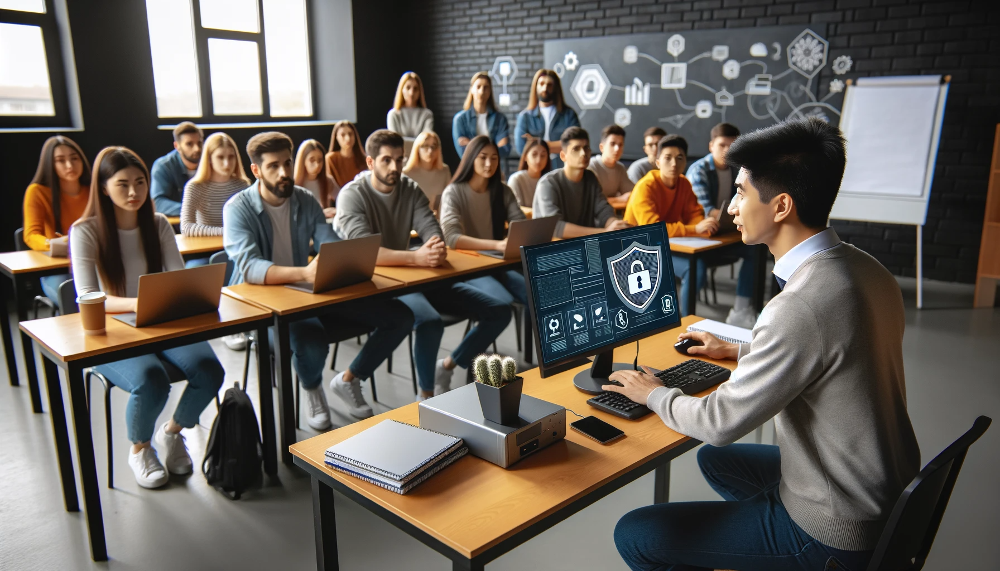

### El riesgo del síndrome de Diógenes digital

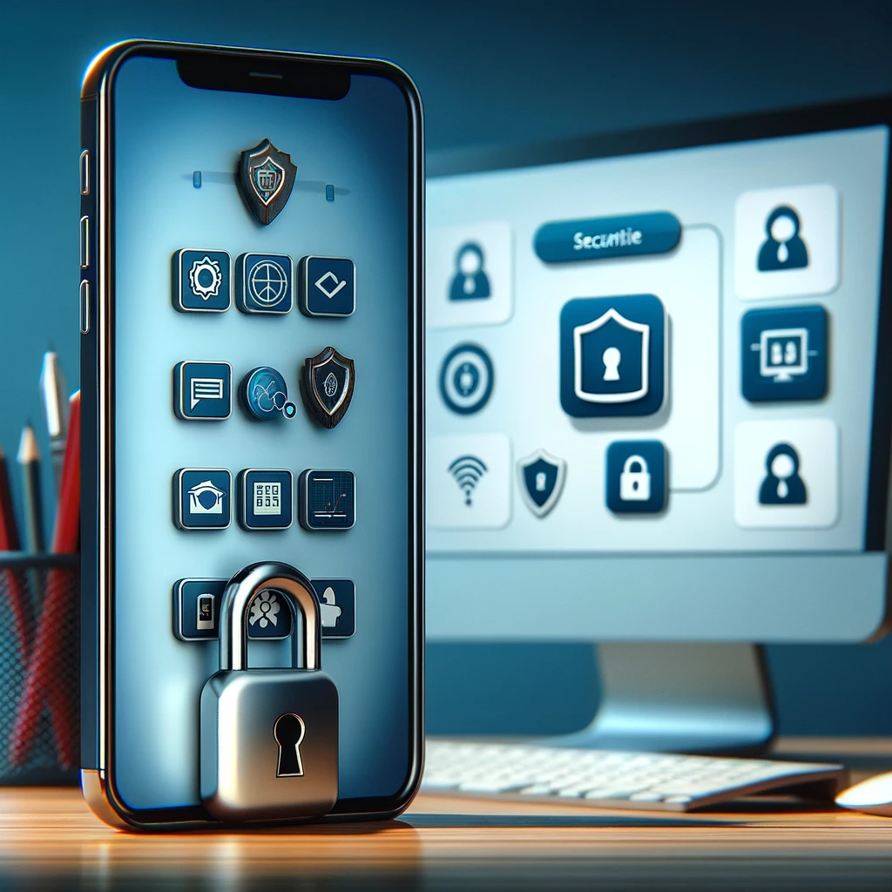

Note: A mayor número de aplicaciones instaladas, mayores son las probabilidades de que alguna de nuestras aplicaciones pueda contener malware o vulnerabilidades. Por ello es importante desinstalar todas las app de orígenes no confiables, o aquellas que no se utilicen.

### 

* Evitar instalaciones innecesarias: seguridad y eficiencia.

* Cada app extra es un riesgo potencial. 
<!-- .element: class="fragment" -->

* Priorizar herramientas esenciales. <!-- .element: class="fragment" -->

* Revisión periódica de aplicaciones en uso. <!-- .element: class="fragment" -->

### Actualizaciones: Escudo Digital

###

* Actualizar = Proteger.

* Evitar [vulnerabilidades conocidas.](https://nvd.nist.gov/) 
<!-- .element: class="fragment" -->

### La regla 3, 2, 1: Plan de Respaldo Infalible

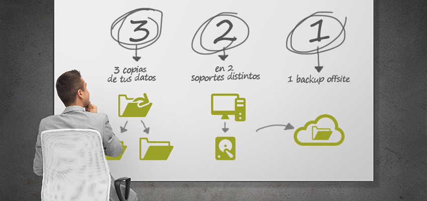

Note:

- 3 copias de cada archivo: Prevenir pérdida total.
- 2 formatos distintos: Reducir riesgos técnicos.
- 1 copia fuera de lugar: Protección contra desastres.

---

## Guardianes de contraseñas seguras

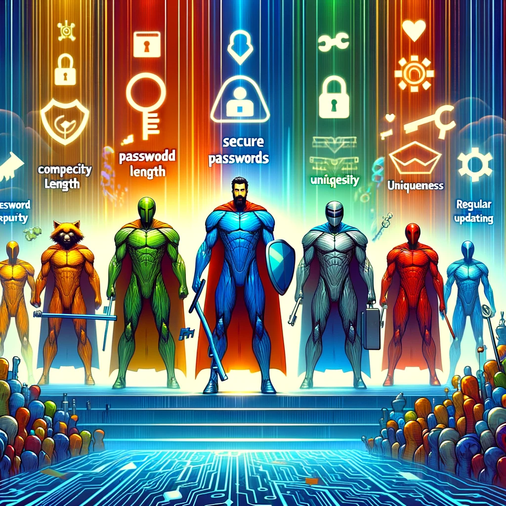

### La Primera Línea de Defensa

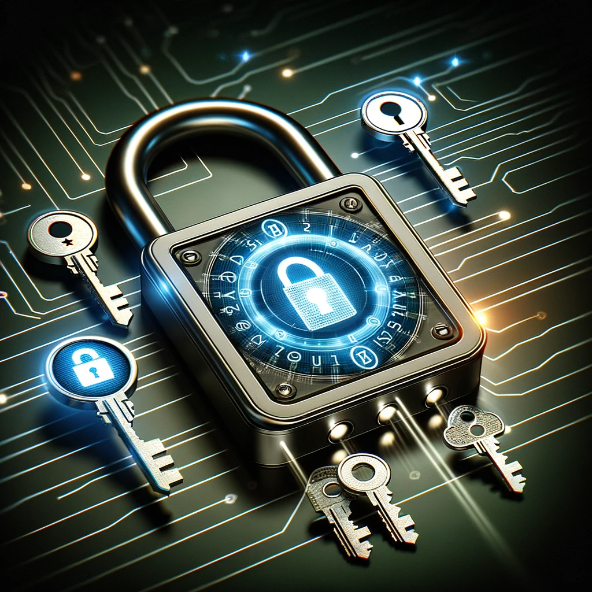

Note:
Las contraseñas son las llaves de nuestras cuentas en línea, protegen nuestra información personal, información financiera, acceso no autorizado. Pero, si no son seguras...

###

* Esenciales para la seguridad en línea.

* Protegen información personal y profesional.<!-- .element: class="fragment" -->

* Son la clave de acceso a nuestros datos.<!-- .element: class="fragment" -->

Note:
Importancia de las Contraseñas Seguras
* [Las 20 contraseñas más usadas en 2022 son también las menos recomendadas](https://www.welivesecurity.com/la-es/2022/11/16/contrasenas-mas-usadas-2022/)

* [Top 200 contraseñas más seguras](https://nordpass.com/es/most-common-passwords-list/)
Demo:
* Importancia contraseña segura: leaks, crack, es importante la longitud y complejidad. 
* Prueba md5sum vs website & decode
* Bases de datos en internet, https://pastebin.com/.
* https://www.exploit-db.com/google-hacking-database
* Leaks de contraseñas: 
    * https://www.dehashed.com/
    * https://haveibeenpwned.com/
    * https://password.kaspersky.com/
- Diversificar => Sherlock - kali | https://seon.io/resources/how-to-find-social-media-accounts-by-email-address-only/

### Construyendo Muros Robustos

### 

* Criterios: Larga, compleja, única.

* El riesgo de lo predecible<!-- .element: class="fragment" -->

*  La regla de oro: diversificar<!-- .element: class="fragment" -->

* Herramientas para crear contraseñas seguras.<!-- .element: class="fragment" -->

Note:
- **El riesgo de lo predecible**. Es fácil caer en la trampa de elegir contraseñas basadas en datos personales: fechas de nacimiento, nombres de mascotas o combinaciones simples como "123456". Sin embargo, los ciberdelincuentes suelen probar primero estas combinaciones obvias, haciendo que las contraseñas predecibles sean un blanco fácil.

- **La regla de oro: diversificar**. Usar la misma contraseña en múltiples plataformas es un riesgo tremendo. Si un ciberdelincuente obtiene tu contraseña de un sitio, inmediatamente tendrá acceso a todos tus demás servicios. La diversificación es clave.

### Tu Cofre Forte Digital

###

* La paradoja de la complejidad.

* ¿Qué es un gestor de contraseñas?.<!-- .element: class="fragment" -->

* Demostración práctica de uso.<!-- .element: class="fragment" -->

* Recomendaciones de gestores populares.<!-- .element: class="fragment" -->

### Más allá de la Contraseña

* Importancia del MFA.<!-- .element: class="fragment" -->

* Cambiar contraseñas regularmente.<!-- .element: class="fragment" -->

Note: 

MFA generalmente involucra tres factores o categorías diferentes de autenticación:

* Algo que conoces: Este factor implica la autenticación basada en el conocimiento, donde el usuario debe proporcionar información que solo él debería conocer, como una contraseña, PIN o la respuesta a una pregunta secreta.

* Algo que tienes: Este factor se refiere a la autenticación basada en la posesión, donde el usuario debe poseer un objeto o dispositivo físico para completar el proceso de autenticación. Puede ser un teléfono móvil, un token de hardware, una tarjeta inteligente o una contraseña de un solo uso (OTP) generada por una aplicación de autenticación.

* Algo que eres: Este factor utiliza la autenticación basada en la biometría, confiando en los rasgos físicos o de comportamiento únicos del usuario. Se utiliza datos biométricos, como reconocimiento facial, huellas dactilares, escaneos de iris o reconocimiento de voz, para verificar la identidad del usuario.

- Autenticación Multifactor vs de 2 Factores

---

## Comunicación segura: Correo electrónico

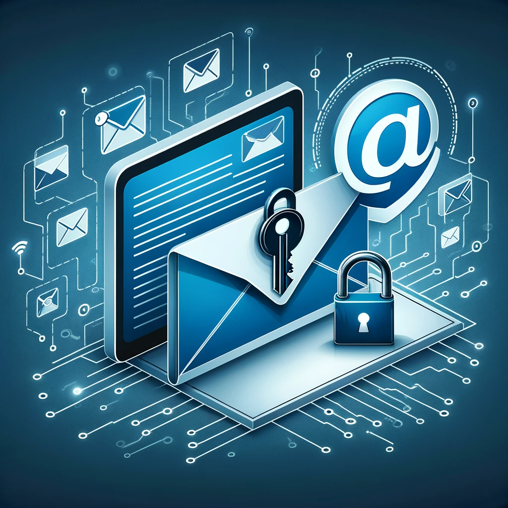

### Blindando tu Buzón: Filtros Antispam

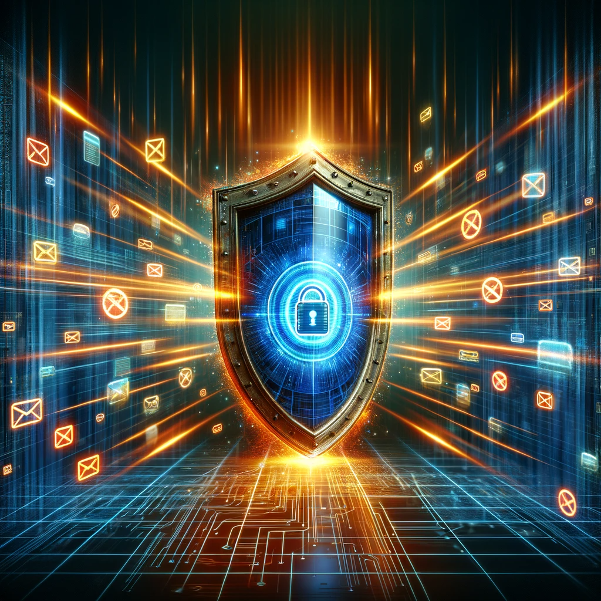

Note:
* Configurar filtros para una bandeja de entrada segura.
* Diferenciar correos legítimos de spam.
* Prácticas esenciales para mantenerse a salvo del spam.

### Detective Digital: Identificando Phishing

Note:
* Aprender a identificar correos sospechosos.
* Ejercicios prácticos de detección.
* Manteniendo la vigilancia contra el fraude.

### Fortaleza de Cifrado: Seguridad en Correos

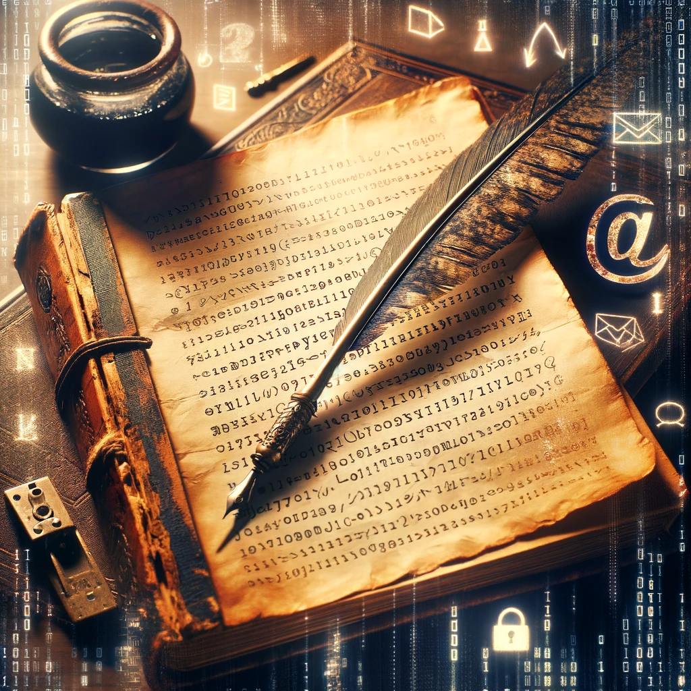

###

* El poder del cifrado de correos electrónicos.

* Cómo y por qué cifrar tus comunicaciones.<!-- .element: class="fragment" -->

* Herramientas prácticas para cifrado.<!-- .element: class="fragment" -->

Note:
En el caso de Gmail, aunque utiliza cifrado en tránsito y en reposo, no ofrece cifrado de extremo a extremo de forma predeterminada. Esto significa que Google, como el proveedor del servicio, tiene la capacidad técnica de acceder a los contenidos de los correos electrónicos almacenados en sus servidores. Por ejemplo, Google puede analizar los correos electrónicos para personalizar la publicidad o mejorar sus servicios, aunque esto se hace de manera automatizada y respetando las normativas de privacidad.

## 

* Para añadir una capa adicional de privacidad y asegurar que solo tú y el destinatario pueden leer el contenido de tus correos electrónicos:

* Pretty Good Privacy (PGP).<!-- .element: class="fragment" -->

* Servicios de Correo Electrónico con Cifrado de Extremo a Extremo: ProtonMail.<!-- .element: class="fragment" -->

Note:
- Pretty Good Privacy (PGP): Este programa ofrece cifrado y autenticación criptográfica, muy usado para cifrar correos.

- Servicios de Correo con Cifrado de Extremo a Extremo: Plataformas como ProtonMail y Tutanota proporcionan cifrado completo, asegurando que solo las partes implicadas en la comunicación pueden acceder al contenido del correo.

Mientras que muchos proveedores de correo electrónico recogen un montón de datos personales, ProtonMail no lo hace. Además de las inscripciones anónimas y la ausencia de registro de direcciones IP, ProtonMail es uno de los pocos proveedores de correo electrónico que permite a sus usuarios disfrutar de un anonimato total.

### Doble Barrera: Autenticación de Dos Factores

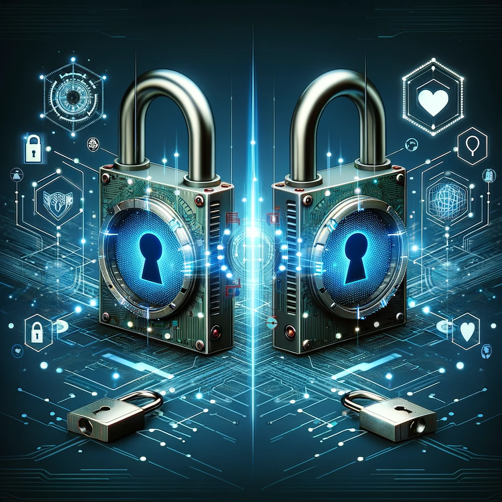

Note:
* Añadiendo una capa extra de seguridad.
* Cómo configurar y utilizar la autenticación de dos factores.
* Protección avanzada para tus cuentas.

---

<!-- .slide: data-background-video="assets/searching.mp4" data-background-opacity="0.6" data-background-video-loop data-background-video-muted-->

## ¿Dudas?
