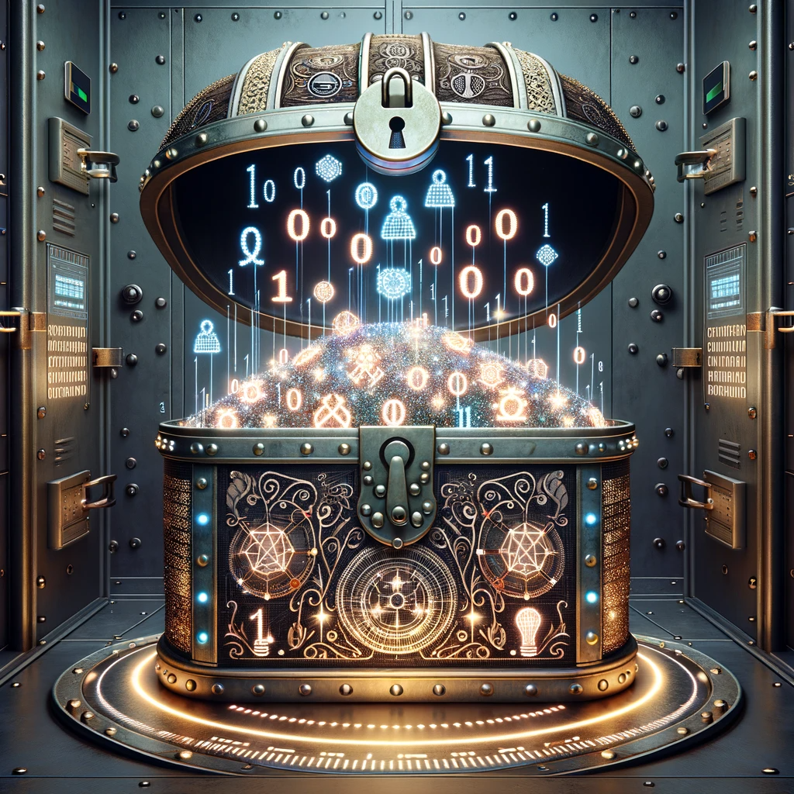

<h2 class="r-fit-text" style="text-align: center"> La ciberseguridad en el ámbito el educativo </h2>

 
---

## Introducción a la Ciberseguridad

### Triada CIA

### Internet fue diseñada por caballeros y para caballeros

### Ataques comunes en las capas del modelo OSI

### El Desafío de Capa 8

Note:
Esta imagen muestra una silueta humana llena de código digital y conexiones de red, simbolizando la vulnerabilidad y complejidad de los factores humanos en la seguridad digital. El fondo incluye capas de escudos y barreras digitales, representando esfuerzos para mejorar las defensas contra las vulnerabilidades humanas. La imagen intenta transmitir que el elemento humano es tanto el más débil como el más crucial en la ciberseguridad.

###

* Capa 8: El Escollo Humano.

* Psicología: Punto de Ataque.<!-- .element: class="fragment" -->

* Sin Solución Única.<!-- .element: class="fragment" -->

* Fortaleciendo Defensas.<!-- .element: class="fragment" -->

Note:
* Capa 8: El Escollo Humano - Destaca la singularidad del factor humano en ciberseguridad.
* Psicología: Punto de Ataque - Subraya cómo las diferencias individuales hacen vulnerables a las personas.
* Sin Solución Única - Reconoce la ausencia de una solución estándar para los problemas de la Capa 8.
* Fortaleciendo Defensas - Enfatiza la importancia de reforzar la seguridad alrededor del elemento humano.

### Peligos más comunes

*  Robo de credenciales<!-- .element: class="fragment" -->

*  Engaños y suplantaciones de identidad (phishing)<!-- .element: class="fragment" -->

*  Pérdida o filtrado de información<!-- .element: class="fragment" -->

*  Medios falibles<!-- .element: class="fragment" -->

### "Mis datos, mi tesoro"

### Sus datos, tu responsabilidad

###
*  ¿Dónde están los datos de mi alumnado?

*  ¿Puedo usar cualquier aplicación libremente?<!-- .element: class="fragment" -->

*  ¿Quién tiene la responsabilidad?<!-- .element: class="fragment" -->

### Estrategia de Defensa en Profundidad

###

* Múltiples Capas de Seguridad.

* Prevención y Detección Combinadas.<!-- .element: class="fragment" -->

* Reducción de Riesgos.<!-- .element: class="fragment" -->

* Adaptabilidad y Resiliencia.<!-- .element: class="fragment" -->

Note:
* Múltiples Capas de Seguridad: Cada capa ofrece protección adicional.
* Prevención y Detección Combinadas: Sistemas complementarios para mayor eficacia.
* Reducción de Riesgos: Cada barrera reduce la probabilidad de brechas.
* Adaptabilidad y Resiliencia: Capacidad para resistir y adaptarse a amenazas cambiantes.

### Guía de Supervivencia: Navegando con Seguridad

Note:
Representación creativa y simbólica de una "Guía de Supervivencia en Ciberseguridad" para profesorado.

La imagen muestra un paisaje digital con un camino que atraviesa diversas amenazas cibernéticas, como enormes candados, correos electrónicos en forma de trampas y almacenamiento de datos en forma de nubes flotantes. Un grupo de personajes animados, representando a profesores, navega con confianza por el camino, armados con escudos y linternas que simbolizan el conocimiento y la conciencia. 

###

* Crear juntos una guía práctica y realista.

* Aprenderemos a protegernos en el mundo digital.<!-- .element: class="fragment" -->

* No hay que temer, ¡estamos preparados!<!-- .element: class="fragment" -->

---

## Resguardando tu privacidad

### Cuando los USB se Vuelven Contra Nosotros

### 

* Daño físico: "USBs pueden quemar equipos".

* Malware oculto: "Riesgo de virus y spyware".<!-- .element: class="fragment" -->

* Robo de datos: "Extracción silenciosa de info".<!-- .element: class="fragment" -->

* Acceso no autorizado: "Permiten hackeos remotos".<!-- .element: class="fragment" -->

* Infiltración de red: "Puerta trasera a sistemas".<!-- .element: class="fragment" -->

### El Pato en Acción: Demostrando la Seguridad USB"

### El Poder del Cifrado: Protegiendo Nuestros Datos

###
* Cifrado de archivos y carpetas.

* Cifrado de un disco duro.<!-- .element: class="fragment" -->

* Cifrado de un dispositivos USB.<!-- .element: class="fragment" -->

* Cifrado de un dispositivo Android.<!-- .element: class="fragment" -->

Note: 
Cifrar los discos, soportes y dispositivos, de tal modo que en caso de pérdida o robo, la información quede protegida y no podrá ser consultada por los ciberdelincuentes. De este modo, solo se convierte en una pérdida económica, evitando una brecha de seguridad de la información.

### Demo

### Selección Consciente de Aplicaciones.

Note: A mayor número de aplicaciones instaladas, mayores son las probabilidades de que alguna de nuestras aplicaciones pueda contener malware o vulnerabilidades. Por ello es importante desinstalar todas las app de orígenes no confiables, o aquellas que no se utilicen.

### 

* Evitar instalaciones innecesarias: seguridad y eficiencia.

* Cada app extra es un riesgo potencial. 
<!-- .element: class="fragment" -->

* Priorizar herramientas esenciales. <!-- .element: class="fragment" -->

* Revisión periódica de aplicaciones en uso. <!-- .element: class="fragment" -->

### Actualizaciones: Escudo Digital

###

* Actualizar = Proteger.

* Evitar [vulnerabilidades conocidas.](https://nvd.nist.gov/) 
<!-- .element: class="fragment" -->

### La regla 3, 2, 1: Plan de Respaldo Infalible

Note:

- 3 copias de cada archivo: Prevenir pérdida total.
- 2 formatos distintos: Reducir riesgos técnicos.
- 1 copia fuera de lugar: Protección contra desastres.

### Navegación Privada

###

* Evita dejar huellas digitales en PCs compartidos.

* Protege tus credenciales en navegación pública.<!-- .element: class="fragment" -->

* La navegación privada no guarda historial ni cookies.<!-- .element: class="fragment" -->

### 

---

## Guardianes de contraseñas seguras

### La Primera Línea de Defensa

###

* Esenciales para la seguridad en línea.

* Protegen información personal y profesional.<!-- .element: class="fragment" -->

* Son la clave de acceso a nuestros datos.<!-- .element: class="fragment" -->

Note:
Importancia de las Contraseñas Seguras
Demo:
* Importancia contraseña segura: leaks, crack,pw es importante la longitud y complejidad. 
* Leaks de contraseñas: 
    * https://www.dehashed.com/
    * https://haveibeenpwned.com/
* Bases de datos en internet, https://pastebin.com/. -->

### Construyendo Muros Robustos

### 

* Criterios: Larga, compleja, única.

* Ejemplos de buenas vs malas contraseñas.<!-- .element: class="fragment" -->

* Herramientas para crear contraseñas seguras.<!-- .element: class="fragment" -->

* La paradoja de la complejidad.<!-- .element: class="fragment" -->

### Tu Cofre Forte Digital

###

* ¿Qué es un gestor de contraseñas?.

* Demostración práctica de uso.<!-- .element: class="fragment" -->

* Recomendaciones de gestores populares.<!-- .element: class="fragment" -->

### Más allá de la Contraseña

* Importancia del MFA.<!-- .element: class="fragment" -->

* Cambiar contraseñas regularmente.<!-- .element: class="fragment" -->

* Variar es más importante de lo que parece.<!-- .element: class="fragment" -->

---

## Comunicación segura: Correo electrónico

### Blindando tu Buzón: Filtros Antispam

Note:
* Configurar filtros para una bandeja de entrada segura.
* Diferenciar correos legítimos de spam.
* Prácticas esenciales para mantenerse a salvo del spam.

### Detective Digital: Identificando Phishing

Note:
* Aprender a identificar correos sospechosos.
* Ejercicios prácticos de detección.
* Manteniendo la vigilancia contra el fraude.

### Fortaleza de Cifrado: Seguridad en Correos

###

* El poder del cifrado de correos electrónicos.

* Cómo y por qué cifrar tus comunicaciones.<!-- .element: class="fragment" -->

* Herramientas prácticas para cifrado.<!-- .element: class="fragment" -->

Note:
En el caso de Gmail, aunque utiliza cifrado en tránsito y en reposo, no ofrece cifrado de extremo a extremo de forma predeterminada. Esto significa que Google, como el proveedor del servicio, tiene la capacidad técnica de acceder a los contenidos de los correos electrónicos almacenados en sus servidores. Por ejemplo, Google puede analizar los correos electrónicos para personalizar la publicidad o mejorar sus servicios, aunque esto se hace de manera automatizada y respetando las normativas de privacidad.

## 

* Para añadir una capa adicional de privacidad y asegurar que solo tú y el destinatario pueden leer el contenido de tus correos electrónicos:

* Pretty Good Privacy (PGP).<!-- .element: class="fragment" -->

* Servicios de Correo Electrónico con Cifrado de Extremo a Extremo: ProtonMail.<!-- .element: class="fragment" -->

Note:
- Pretty Good Privacy (PGP): Este programa ofrece cifrado y autenticación criptográfica, muy usado para cifrar correos.

- Servicios de Correo con Cifrado de Extremo a Extremo: Plataformas como ProtonMail y Tutanota proporcionan cifrado completo, asegurando que solo las partes implicadas en la comunicación pueden acceder al contenido del correo.

### Doble Barrera: Autenticación de Dos Factores

Note:
* Añadiendo una capa extra de seguridad.
* Cómo configurar y utilizar la autenticación de dos factores.
* Protección avanzada para tus cuentas.

---

<!-- .slide: data-background-video="assets/searching.mp4" data-background-opacity="0.6" data-background-video-loop data-background-video-muted-->

## ¿Dudas?
