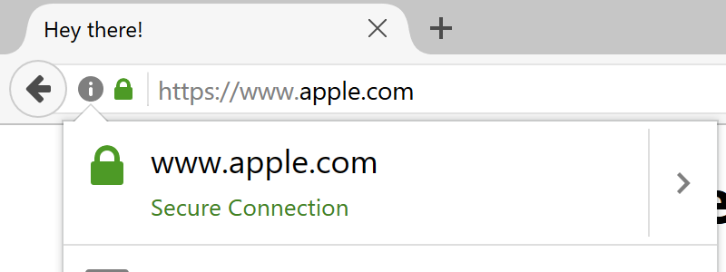
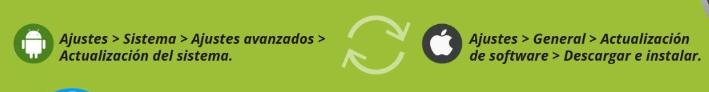

<h2 class="r-fit-text" style="text-align: center"> La ciberseguridad en el ámbito el educativo </h2>

 
---

<!-- Sesión 2: Prevención de amenazas en línea
- Navegación sin sobresaltos.
- Detectives digitales: Identificando señales de estafas y fraudes en línea.
- Resistiendo el Ransomware
- Seguridad en dispositivos móviles: Protegiendo tu información en smartphones y tablets. -->

## Navegación sin Sobresaltos 

Note:
- Explicar el concepto de navegación segura y su importancia en la protección de la información personal y la prevención de amenazas en línea.
- Diferencias entre seguridad y privacidad en internet
- Diferencias entre seguridad y privacidad en internet; por un lado, mientras que la privacidad se centra en el control sobre la información personal que compartimos en internet, la seguridad se centra en la protección de esa información, es decir, evitar que terceros puedan acceder a ella cuando no está expuesta.

### El Arte de Navegar Desapercibido

### Huella Digital: Impacto y Gestión

- Entendiendo qué es una huella digital.<!-- .element: class="fragment" -->

- Cómo se crea y se acumula información.<!-- .element: class="fragment" -->

- Riesgos asociados a una huella digital amplia.<!-- .element: class="fragment" -->

- Estrategias para minimizar tu huella.<!-- .element: class="fragment" -->

Note:

- **Entendiendo qué es una huella digital**: Una huella digital es el rastro de datos que dejamos en línea. Incluye información que compartimos conscientemente, como publicaciones en redes sociales, y datos recopilados por sitios web, como hábitos de navegación.
  
- **Cómo se crea y se acumula información**: Cada acción en línea, desde buscar en Google hasta comprar en línea, contribuye a nuestra huella digital. Menciona cómo los cookies y otros rastreadores recogen información que se acumula con el tiempo.
  
- **Riesgos asociados a una huella digital amplia**: Riesgos de tener una huella digital grande; como la exposición a la publicidad dirigida, el robo de identidad, y la pérdida de privacidad. Puede incluir ejemplos recientes de violaciones de datos o uso indebido de información personal.
  
- **Estrategias para minimizar tu huella**: Consejos prácticos para reducir la huella digital, usar navegadores con protección de privacidad, desactivar el seguimiento de ubicación, y ser más conscientes de la información que compartimos en línea. También puedes mencionar el uso de VPNs y la importancia de revisar regularmente las configuraciones de privacidad en las cuentas en línea.

### 

- Elegir Sabiamente.

- Modo de Navegación Privada.<!-- .element: class="fragment" -->

- Configuraciones de Privacidad y Seguridad.<!-- .element: class="fragment" -->

- Extensiones Útiles para privacidad.<!-- .element: class="fragment" -->

Note:

**Elegir sabiamente**: 
- Ver que actividad guarda google.
- Navegador vs motor de búsqueda.
Navegadores habituales vs Tor vs Brave. Brave bloquea todos los anuncios, solicitudes y cookies de terceros, al tiempo que usa NoScript y HTTPS en todas partes. Pero no ejecuta sus datos a través de múltiples capas como lo hace TOR.

El resultado es una experiencia mucho más privada de lo habitual, pero no significa que seas 100% anónimo. Sin embargo, esto también significa que Brave generalmente se desempeña mucho mejor que Tor.

**Mostrar cómo ajustar la configuración de seguridad** en navegadores populares para proteger la información del usuario.

**Modo incognito**:
- Evita dejar huellas digitales en PCs compartidos.
- Protege tus credenciales en navegación pública.
- La navegación privada no guarda historial ni cookies.
- Útil para proteger la privacidad en sesiones múltiples.

**Extensiones útiles para privacidad**:
- uBlock Origin. Un bloqueador de anuncios y rastreadores eficiente. No solo ayuda a mejorar la privacidad al bloquear rastreadores de terceros, sino que también puede acelerar la carga de las páginas web y reducir el uso de datos. Disponible para: Chrome, Firefox, Safari, y otros navegadores compatibles.
- Cómo ayuda: Evita que los anuncios y rastreadores recopilen datos sobre la actividad en línea, mejorando la privacidad y la seguridad.

### 

### Garantía de Derechos Digitales de la LOPDGDD

<!-- .element: class="fragment" -->

Note:
- Aunque la ley ampara al usuario a eliminar su rastro digital no es sencillo, por lo que lo mejor es intentar minimizar la cantidad de datos que, voluntariamente se suben a internet. 
- Búscate a ti mismo en la red: Esto incluye no solo tu nombre, sino también tus distintos correos y otros datos personales. De este modo sabrás dónde siguen apareciendo datos que pueden relacionarse contigo. 

### Maestro… creo que me he dejado la sesión abierta

Note:
- Cerrar la sesión de GMail «remotamente».
- Localizar teléfono asociado

## Claves para una Navegación Segura Segura

### Riesgos Comunes en Internet

- Phishing y sitios falsos.<!-- .element: class="fragment" -->

- Conexiones no seguras.<!-- .element: class="fragment" -->

- Descargas peligrosas.<!-- .element: class="fragment" -->

Note: 

Iniciamos con una visión general de los riesgos más comunes en la navegación web, como el phishing, descargas maliciosas, conexiones inseguras y publicidad engañosa. Discutiremos cómo identificar y evitar estas amenazas.

## Certificados SSL y Sitios Web Seguros

Note:

- ¿Qué son los certificados SSL?

- Cifrado de datos

- Verificación de certificados

Explicar qué son los certificados SSL, cómo funcionan y cómo ayudan a identificar sitios web seguros.
- **Demo con http://pruebadeuso.com/index.php?r=site/login y wireshark.**  

### Cómo Verificar la Confiabilidad de un Sitio Web

- HTTPS en la URL <!-- .element: class="fragment" -->

- Candado en la barra <!-- .element: class="fragment" -->

- Certificados válidos <!-- .element: class="fragment" -->

- Verificación del sitio <!-- .element: class="fragment" -->

Note:
- **HTTPS en la URL**: Esto indica que el sitio web está utilizando el protocolo HTTPS (Hypertext Transfer Protocol Secure). El HTTPS es una versión segura del HTTP y significa que toda la comunicación entre tu navegador y el sitio web está cifrada. Esto ayuda a proteger la información sensible de ser interceptada por terceros.

- **Candado en la barra de direcciones**: Este es un indicador visual que proporcionan los navegadores web para mostrar que una conexión es segura, es decir, que el sitio está utilizando HTTPS. Sin embargo, el candado por sí solo no garantiza la total legitimidad o seguridad del sitio; simplemente indica que la conexión está cifrada.

- **Certificados válidos**: Los certificados SSL/TLS son lo que habilita al sitio web a usar HTTPS. Un certificado válido significa que una autoridad de certificación de confianza ha emitido un certificado para ese sitio web en particular. Este certificado no solo cifra los datos, sino que también verifica la identidad del propietario del sitio web. Un certificado puede ser técnicamente válido (es decir, está correctamente configurado y aún no ha expirado), pero eso no significa necesariamente que el sitio web sea confiable en términos de contenido o intenciones.

En resumen:

- **HTTPS** en la URL muestra que el sitio está utilizando un protocolo seguro.
- El **candado en la barra de direcciones** es un indicador visual de que la conexión es segura.
- **Certificados válidos** aseguran que la conexión no solo es segura, sino que también confirma la autenticidad del sitio web al que teestás conectando.
- **Verificación del sitio**.

### 

- Revisión de URL y dominio.

- Buscar opiniones y reseñas.<!-- .element: class="fragment" -->

- Evitar sitios con alertas.<!-- .element: class="fragment" -->

### Di NO al software pirata

Note: 

Discutir las mejores prácticas al descargar archivos, incluyendo la selección de fuentes confiables y el uso de herramientas antivirus.
- **Demo fichero con reverse shell.**

### Precauciones al Descargar

- Fuentes confiables.<!-- .element: class="fragment" -->

- Evitar descargas automáticas.<!-- .element: class="fragment" -->

- Revisar extensiones de archivo.<!-- .element: class="fragment" -->

- Uso de antivirus.<!-- .element: class="fragment" -->

Note: 

Discutir las mejores prácticas al descargar archivos, incluyendo la selección de fuentes confiables y el uso de herramientas antivirus.
- **Demo fichero con reverse shell.**

### Nunca, Never, Jamais, hacer clic en enlaces NO solicitados

Note:

Explicar cómo manejar enlaces sospechosos, incluyendo la verificación de URLs y la identificación de técnicas de phishing.

- No clickear enlaces desconocidos
- Verificar la URL
- Técnicas de phishing
- Concientización sobre estafas

### Prácticas Recomendadas para una Navegación Segura

- Actualizaciones regulares.<!-- .element: class="fragment" -->

- Uso de contraseñas fuertes.<!-- .element: class="fragment" -->

- Evitar clics impulsivos.<!-- .element: class="fragment" -->

- No usar software pirata.<!-- .element: class="fragment" -->

Note: Aquí, discutiremos prácticas recomendadas para mantenernos seguros en línea, como mantener nuestros sistemas y aplicaciones actualizados, usar contraseñas fuertes, evitar clics impulsivos y revisar las configuraciones de seguridad de nuestros dispositivos.
- Actualizaciones regulares. Mantén tu navegador y sistema operativo actualizados para protegerte contra vulnerabilidades de seguridad.

- Uso de contraseñas fuertes. Utiliza contraseñas únicas y complejas para cada sitio web y servicio en línea.

- Evitar clics impulsivos. No hagas clic en enlaces sospechosos y evita descargar archivos de fuentes no confiables.

- No usar software pirata. El software pirata puede contener malware y exponerte a riesgos de seguridad.

- Revisar la confiabilidad de los sitios web. Verifica la presencia de HTTPS, el candado de seguridad en la barra de direcciones y la autenticidad del dominio.

---

## Detectives digitales

Note:
Identificando señales de estafas y fraudes en línea

### Tipos de Estafas Más Comunes

- Phishing.<!-- .element: class="fragment" -->

- Fraude Financieros y de Inversión.<!-- .element: class="fragment" -->

- Scam Romántico.<!-- .element: class="fragment" -->

- Estafas de Soporte Técnico.<!-- .element: class="fragment" -->

- Ransomware.<!-- .element: class="fragment" -->

Note: Discutir cómo cada tipo de estafa opera brevemente, destacando sus características principales.

**Phishing**: Es uno de los métodos más comunes y efectivos utilizados por los ciberdelincuentes. Implica el envío de correos electrónicos o mensajes que parecen provenir de fuentes legítimas para engañar a las personas y obtener información confidencial.

**Fraudes Financieros y de Inversión**: Estafas relacionadas con inversiones falsas, ofertas de crédito fraudulentas, y esquemas de 'hacer dinero rápido'. Estos fraudes prometen grandes retornos financieros con poco o ningún riesgo.

**Scams Románticos**: Los estafadores crean perfiles falsos en sitios de citas o redes sociales para establecer relaciones y eventualmente pedir dinero bajo pretextos falsos.

**Estafas de Soporte Técnico**: Los estafadores se hacen pasar por representantes de soporte técnico de empresas conocidas para engañar a las víctimas y obtener acceso a sus dispositivos o información personal.

**Ransomware**: Aunque técnicamente es un tipo de malware más que una estafa, el ransomware ha sido muy común. 
La palabra "ransom" significa "rescate", mientras que "ware" viene de la palabra "software" (una aplicación o programa informático hecho para realizar operaciones o funciones específicas). Entonces "ransom-ware", es el termino utilizado para referirse a un software que pide un rescate. Análogamente, "mal-ware" es la unión de la palabra "malicious" y "software" y es el término utilizado para designar un software malicioso (con mala intención). Por lo tanto, ransomware es un tipo de malware, específicamente diseñado para "secuestrar" datos informáticos y pedir un rescate a cambio de que los datos se vuelvan accesibles nuevamente.   

### Delivery... Formas de Hacértela Llegar

- Correos electrónicos.<!-- .element: class="fragment" -->

- Mensajes de texto.<!-- .element: class="fragment" -->

- Llamadas telefónicas.<!-- .element: class="fragment" -->

- Redes sociales.<!-- .element: class="fragment" -->

- Anuncios online.<!-- .element: class="fragment" -->

Note: Explicar cómo los estafadores usan estos medios para contactar a sus víctimas.

### Cronología del Engaño: De Correos a Cibertrucos

### 

> Primero apuntaron a mejorar notablemente el diseño de los engaños de phishing, utilizando imágenes elaboradas o la inclusión de iframes provenientes de una página auténtica.

###

> Además, gracias a las ventajas que hoy en día proporcionan los diccionarios y traductores en línea, logran evitar (algunos) errores de gramática u ortografía en los correos.

### 

> Ya no basta con mirar la dirección del remitente de un correo electrónico o SMS, ya que gracias a las técnicas de spoofing un atacante se puede hacer pasar por una entidad distinta, falsificando los datos en una comunicación.

###

> Aún así, nos quedaba un consejo que, hasta ahora, creíamos infalible: revisar que la página sea segura, que utilice el protocolo HTTPS y, sobre todo, que tenga el certificado de seguridad.

### Ataques Homográficos

- No es que los usuarios sean tontos, es difícil de detectar.<!-- .element: class="fragment" -->

- URLs engañosas.<!-- .element: class="fragment" -->

- Aprovechamiento de similitudes.<!-- .element: class="fragment" -->

- Uso de caracteres especiales.<!-- .element: class="fragment" -->

Note: Explicar cómo los ataques homográficos utilizan URLs que parecen legítimas pero tienen pequeñas diferencias.

### Ataques Homograficos

www.iesrafaelalberti.es<!-- .element: class="fragment" -->

### 

www.iesrafae1alberti.es

Sustitución Simple de Caracteres<!-- .element: class="fragment" -->

Sustitución de la letra 'l' por el número '1'<!-- .element: class="fragment" -->

### 

www.iesrafaelalberti.com 

Cambio de Dominio, cambiando el '.es' por '.com'.<!-- .element: class="fragment" -->

### 

www.iesrafaelalbertii.es

Inserción de Caracteres Adicionales.<!-- .element: class="fragment" -->

Duplicando la última 'i'.<!-- .element: class="fragment" -->

### 

www.iesrafalberti.es

Omisión de Caracteres.<!-- .element: class="fragment" -->
 
Eliminando la 'e' en 'rafael'.<!-- .element: class="fragment" -->

### 

www.iesrafaelalberti.security-update.es

Subdominios Engañosos.<!-- .element: class="fragment" -->

Creando un subdominio que parezca legítimo.<!-- .element: class="fragment" -->

### 

www.iesrafaelalbertí.es

Uso de Caracteres Especiales.<!-- .element: class="fragment" -->

Añadiendo un acento a la última letra.<!-- .element: class="fragment" -->

[https://www.dominios.es/es](https://www.dominios.es/es)<!-- .element: class="fragment" -->

Note:
Es posible registrar dominios con caracteres especiales, incluidos acentos o tildes. Estos dominios se conocen como dominios internacionalizados o IDN (Internationalized Domain Names). Permiten el uso de caracteres no ASCII, como letras con tildes, cedillas, umlauts, y otros diacríticos propios de diferentes idiomas.

Los navegadores modernos están equipados para manejar estos IDN, mostrándolos en la barra de direcciones en su forma punycode para evitar confusiones y posibles ataques homográficos. El punycode es una representación ASCII de caracteres Unicode, utilizada para convertir nombres de dominio con caracteres especiales en una secuencia de caracteres permitidos en los nombres de dominio.

### 

www.iesrafaelаlberti.es

Usando caracteres especiales.<!-- .element: class="fragment" -->

Sustituyendo una 'a' latina por una 'а' cirílica, que se ve igual pero es un carácter diferente.<!-- .element: class="fragment" -->

### 

### 

### 

Note: 

https://www.аррӏе.com/

https://www.xudongz.com/blog/2017/idn-phishing/

about:config

network.IDN_show_punycode --- true

### Señales de Alerta

- Ofertas demasiado buenas.<!-- .element: class="fragment" -->

- Urgencia excesiva.<!-- .element: class="fragment" -->

- Errores gramaticales.<!-- .element: class="fragment" -->

- Solicitudes de información personal.<!-- .element: class="fragment" -->

Note: Enfatizar la importancia de estar atentos a estas señales para identificar posibles estafas.

### Protección y Prevención

- Uso de software de seguridad.<!-- .element: class="fragment" -->

- Investigar antes de actuar.<!-- .element: class="fragment" -->

- No compartir datos sensibles.<!-- .element: class="fragment" -->

- Desconfiar de lo no solicitado.<!-- .element: class="fragment" -->

- Pensamiento crítico y sentido común.<!-- .element: class="fragment" -->

Note: 

Dar consejos prácticos sobre cómo las personas pueden protegerse de las estafas.

- Uso de sw de seguridad: extensiones, virustotal, unshorter...

- Hablar de los enlaces en los emails, poner raton encima, comprobar dominio, 

Pero sin duda lo más importante es el sentido común. Muchos de los principales ataques necesitan la interacción del usuario. Necesitan que cometamos errores para poder desplegar sus ataques. Por ejemplo abrir un archivo adjunto malicioso que nos llega por correo electrónico o abrir una página que es insegura en el navegador. Debemos siempre extremar las precauciones.

### Casos prácticos

<!-- ### Recursos Educativos

 -->

### Actuando Ante una Estafa

- No responder.<!-- .element: class="fragment" -->

- Reportar a las autoridades.<!-- .element: class="fragment" -->

- Cambiar contraseñas.<!-- .element: class="fragment" -->

Note: Instruir sobre las acciones a tomar si se sospecha o se confirma ser víctima de una estafa.

### La Nueva Era del Fraude: Estafas Impulsadas por IA

Note:

- Creación de perfiles falsos. 

- Mensajes personalizados. 

- Deepfakes en medios sociales. 

- Automatización de ataques phishing. 

En esta diapositiva, discutimos cómo la inteligencia artificial (IA) está siendo utilizada para potenciar estafas en línea. Abordamos cómo los estafadores utilizan IA para crear perfiles falsos convincentes en redes sociales y enviar mensajes personalizados, aumentando así la efectividad de sus engaños. También cubrimos el fenómeno de los deepfakes, vídeos o imágenes alteradas de manera realista, usados para crear desinformación o suplantar identidades. Finalmente, hablamos de cómo la IA permite la automatización y personalización masiva de ataques phishing, haciéndolos más difíciles de detectar.

---

## Resistencia al Ransomware

###

- Qué es el ransomware.

- Medidas preventivas clave.<!-- .element: class="fragment" -->

- Respuesta ante un ataque.<!-- .element: class="fragment" -->

- Herramientas y recursos útiles.<!-- .element: class="fragment" -->

Note: 

En esta parte, abordaremos qué es el ransomware y cómo puede afectar nuestro trabajo como docentes. Discutiremos estrategias preventivas, cómo actuar en caso de ser víctima de un ataque de ransomware, y revisaremos algunas herramientas y recursos para mejorar nuestra seguridad.

### Factores que te convertierten en el objetivo de un ataque de ransomware.

- Que el dispositivo utilizado sea antiguo.<!-- .element: class="fragment" -->

- Que el dispositivo tenga software obsoleto.<!-- .element: class="fragment" -->

- Que los navegadores o sistemas operativos no tengan los parches más recientes.<!-- .element: class="fragment" -->

- Que no exista un plan de copias de seguridad adecuado.<!-- .element: class="fragment" -->

- Que se se haya prestado insuficiente atención a la ciberseguridad.<!-- .element: class="fragment" -->

### Protección contra ransomware: cómo prevenir una infección

- Nunca haga clic en enlaces no solicitados.<!-- .element: class="fragment" -->

- Evite revelar información personal.<!-- .element: class="fragment" -->

- No abra archivos adjuntos de correos electrónicos sospechosos.<!-- .element: class="fragment" -->

- No utilice nunca memorias USB desconocidas.<!-- .element: class="fragment" -->

### 

- Mantenga sus programas y sistema operativo actualizados.

- Utilice solo fuentes de descarga conocidas.<!-- .element: class="fragment" -->

- Utilice servicios VPN en las redes Wi-Fi públicas.<!-- .element: class="fragment" -->

---

## Blindando tus Dispositivos Móviles

Note:

Cómo mantener segura nuestra información en dispositivos móviles. Cubriremos los riesgos asociados con smartphones y tablets, cómo configurar adecuadamente nuestros dispositivos, la importancia de las actualizaciones y las aplicaciones seguras, así como buenas prácticas para el uso diario.

### Protege el acceso a tu dispositivo

<!-- .element: class="fragment" -->

### Comprueba que tu dispositivo está actualizado

<!-- .element: class="fragment" -->

### Copias de seguridad

<!-- .element: class="fragment" -->

### Descarga e instala las aplicaciones desde las tiendas oficiales

<!-- .element: class="fragment" -->

### Activa el doble factor de autenticación

<!-- .element: class="fragment" -->

### Antivirus

### Algo de ayuda extra...

Note:
Nos permitirá conocer el estado de seguridad de nuestros dispositivos, mostrando posibles riesgos en su configuración y cómo solucionarlos. Además, verifica que no tengamos instalada ninguna app maliciosa, nos alerta en caso de detectar ciertas situaciones de riesgo, y nos proporciona consejos para mejorar nuestra seguridad.

---

<!-- .slide: data-background-video="assets/searching.mp4" data-background-opacity="0.6" data-background-video-loop data-background-video-muted-->

## ¿Dudas?

---

## ¡Escanea, Opina, y Sonríe!